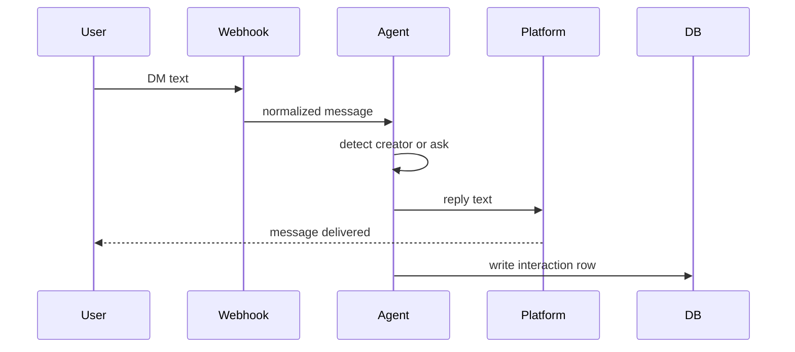

# AI Discount Agent

A production-minded backend system that automates discount code distribution in DMs across Instagram, TikTok, and WhatsApp.

## Architecture Overview

### System Diagram


flowchart TD
  P[DM from IG or TT or WA]
  W[Webhook receive]
  N[Normalize message]
A[Agent - LangGraph
 detect creator
 or ask for creator]
  R[Send reply via platform API]
  D[Log interaction in DB]
  X[Analytics read DB]

  P --> W --> N --> A --> R --> D --> X

## Quick Demo (2 minutes)

```bash
git clone <your-repo-url>
cd ai-discount-agent
./setup.sh              # Setup virtual environment and dependencies
./demo.sh               # Run the standalone agent demo

# Optional advanced demo (explain + mock LLM + clean state)
python scripts/demo_agent.py --explain --reset --mock-llm success
```

### Sample Output (abbreviated)
```
INPUT:
  mkbhd sent me
METHOD:
  📏 EXACT MATCH
REPLY:
  Here's your discount code from mkbhd: MARQUES20 🎉
ROW:
  {"user_id":"demo_user","platform":"instagram","timestamp":"2025-09-13T10:00:00.000Z", ...}

INPUT:
  discount
METHOD:
  (no creator detected)
REPLY:
  Thanks for your message! Which creator sent you? 😊
```

## Approach Overview

We prioritize a hybrid detection strategy: exact alias matching first, then fuzzy matching, finally bounded LLM fallback. The system avoids guessing to prevent incorrect code distribution.

**Key decisions:**
- **In-memory storage for demo** (files are for documentation)
- **Bounded LLM** (2 attempts, 2s total budget by default, only allow-listed responses)
- **Intent detection** prevents spam/abuse by asking out irrelevant messages
- **One code per user per platform** prevents fraud

First, we address state and idempotency. Each platform is treated separately. The unit of truth is "campaign + platform + user," and each message has a unique message ID for unique identification. This approach maintains simplicity and security by ensuring that each user has their own unique code for each campaign on each platform.

We use a hybrid processing model with a fast webhook acknowledgment. A worker does most of the work, and we can reply inline if a message contains a clear exact alias and the user hasn't received a code yet. Otherwise, we queue and reply from the worker to avoid timeouts and maintain speed.

Creator detection is rule-first. First, we normalize the text, then we check for exact aliases and use a tight fuzzy match. If the rules cannot decide, we call Gemini 2.5 Flash Lite once within a strict budget with allow-listed JSON. If it times out or appears incorrect, we do not make an educated guess. We ask the user to name the creator.

The code policy is straightforward. Each user is limited to one code per campaign per platform. The first confident match gets attribution. Resending returns the same code without creating a new issuance.

We use LangGraph to express the decision flow. The graph is a single pass: normalize → exact → fuzzy → Gemini → decide. The worker calls the graph and receives a user reply and a row for logging.

Configuration lives outside of the code. Creators, codes, aliases, thresholds, and templates are in YAML. We can hot-reload them. Secrets come from environment variables.

Persistence follows the assignment of one simple table. We store the platform, user, timestamp, raw text, identified creator (if applicable), discount code (if applicable), and conversation status. In production, we would add unique constraints for webhook deduplication and issuance guards. We include these as commented "notes" in the schema file.

This design is scalable. If the number of creators grows to the hundreds or thousands, we can swap the matcher under the same interface (Aho–Corasick + n-gram retrieval). The agent, worker, and API would remain the same.


## Agent Function (Step 2)

The core requirement is met through `run_agent_on_message()`:

```python
from scripts.agent_graph import run_agent_on_message

result = run_agent_on_message("mkbhd sent me")
# Returns: {"reply": str, "database_row": dict}
```

## Tooling Justification

**LangGraph + LangChain**: Explicit state machines for reliable AI workflows
**Pydantic**: Type safety and validation throughout the system
**FastAPI**: Production-ready web framework for high-throughput APIs
**RapidFuzz**: Efficient fuzzy string matching
**Gemini 2.5 Flash Lite**: Cost-effective LLM with bounded execution

Each tool is chosen for its production maturity and operational reliability.

## Database Schema

The provided `design/schema.sql` meets the assignment requirements with a Postgres design. The app uses an in‑memory store for the demo, but the production table is:

```sql
CREATE TABLE IF NOT EXISTS interactions (
  id BIGSERIAL PRIMARY KEY,
  user_id TEXT NOT NULL,
  platform TEXT NOT NULL CHECK (platform IN ('instagram','tiktok','whatsapp')),
  timestamp TIMESTAMPTZ NOT NULL,
  raw_incoming_message TEXT NOT NULL,
  identified_creator TEXT NULL,
  discount_code_sent TEXT NULL,
  conversation_status TEXT NOT NULL CHECK (
    conversation_status IN ('pending_creator_info','completed','error','out_of_scope')
  )
);
```

Recommended indexes are included in comments (webhook idempotency and issuance guard). The agent returns a `database_row` JSON that maps 1:1 to this schema.

## LLM Provider Configuration

**Model**: Gemini 2.5 Flash Lite via google-generativeai
**Execution**: Bounded with 2 attempts, 8s total budget (default), 4000ms per attempt
**Validation**: Strict JSON mode with {"creator":"<allow-listed|none>"} response
**Fallback**: If LLM fails after retries, system asks for creator clarification

Set your key:
```bash
export GOOGLE_API_KEY=your_google_api_key_here
```

## Bonus Features

### A) Multi-Platform Considerations
See `design/multi-platform.md` for details on platform APIs, webhook signatures, reply windows (e.g., WhatsApp 24h), and business requirements. This repo includes working normalizers and signature stubs:

- Code: `scripts/platform_normalizer.py`
  - `normalize_instagram`, `normalize_tiktok`, `normalize_whatsapp` → map raw payloads to `IncomingMessage`
  - HMAC-SHA256 verification stubs for Instagram/WhatsApp (`X-Hub-Signature-256`) and TikTok (`X-TikTok-Signature`)
- API: `/webhook/{platform}`
  - Verifies signature when `IG_APP_SECRET`/`WHATSAPP_APP_SECRET`/`TIKTOK_APP_SECRET` is set
  - Normalizes payload, runs the agent asynchronously, persists a row, and returns `{reply, database_row, detection_method, detection_confidence}`
- Tests: `tests/test_platform_normalizer.py` exercise normalization across all three platforms

Example env:
```bash
export IG_APP_SECRET=...         # enables Instagram signature check
export WHATSAPP_APP_SECRET=...   # enables WhatsApp signature check
export TIKTOK_APP_SECRET=...     # enables TikTok signature check
```

Example payloads and behavior are documented in `design/multi-platform.md`. In production, add:
- Rate-limit backoff by platform
- 24h session window enforcement for WhatsApp template messages
- Idempotency by `(platform, message_id)`

### B) Enrichment & Lead Scoring
Agent enrichment generates deterministic follower counts and potential influencer flags when creator is identified:
```json
{
  "follower_count": 15000000,
  "is_potential_influencer": true
}
```

### C) Analytics Endpoint
```
GET /analytics/creators
```
Returns aggregated summary of codes distributed by creator and platform.

## API Endpoints

### `/simulate` (POST)
End-to-end message processing for testing:
```json
{
  "platform": "instagram",
  "user_id": "user123",
  "message": "discount from mkbhd"
}
```
Response:
```json
{
  "reply": "Here's your discount code from mkbhd: MARQUES20 🎉",
  "database_row": { ... },
  "detection_method": "exact|fuzzy|llm|null",
  "detection_confidence": 0.0
}
```

### `/webhook/{platform}` (POST)
Prototype webhook endpoint that processes messages inline. For production, the diagrams show a planned fast‑path/worker split.

### `/analytics/creators` (GET)
Summary statistics for campaign effectiveness (by creator, across all platforms). Response shape:
```json
{
  "total_creators": 3,
  "total_requests": 10,
  "total_completed": 6,
  "creators": {
    "mkbhd": {
      "requests": 5,
      "codes_sent": 4,
      "platform_breakdown": {
        "instagram": { "requests": 4, "codes_sent": 3 },
        "tiktok":    { "requests": 1, "codes_sent": 1 }
      }
    }
  }
}
```

### `/admin/reload` (POST)
Hot-reload campaign and template configs from YAML.

### `/admin/reset` (POST)
Demo-only endpoint to clear the in-memory store.

## Testing

Run the test suite:
```bash
./test.sh
```

The suite covers:
- **Detection logic**: exact/alias, fuzzy acceptance, fuzzy-aware intent (“from <handle>”)
- **Normalization**: punctuation/Unicode/emoji/whitespace/hyphenation — still detects the right creator
- **Conversational flows**: ask → creator, out_of_scope → creator, resend blocked
- **LLM fallback**: retry success (mocked), terminal none; bounded time budgets
- **Integration**: /simulate end-to-end, analytics summary aggregation
- **Idempotency**: one-code-per-user guarantee per (platform,user)
- **Admin**: /admin/reset clears store; /admin/reload applies new aliases

## Campaign Configuration

Creator codes and aliases in `config/campaign.yaml`:

```yaml
creators:
  casey_neistat:
    code: CASEY15OFF
    aliases:
      - casey
      - neistat
      - @casey
  mkbhd:
    code: MARQUES20
    aliases:
      - marques
      - mkbhd
      - @mkbhd
    threshold: 0.8  # Fuzzy match threshold
```

Reply templates in `config/templates.yaml`:

```yaml
replies:
  issue_code: "Here's your discount code from {creator_handle}: {discount_code} 🎉"
  ask_creator: "Which creator sent you? I have codes from Casey Neistat, Marques Brownlee, Lily Singh, Peter McKinnon."
  ambiguous: "Could you clarify which creator sent you? {creator_handle} or {other_creator}?"
```

## Setup Instructions

1. **Clone and install**:
   ```bash
   git clone <your-repo-url>
   cd ai-discount-agent
   ./setup.sh
   ```

2. **Optional LLM setup**:
   ```bash
   export GOOGLE_API_KEY=your_api_key
   ```

3. **Run demo**:
   ```bash
   ./demo.sh             # quick demo
   # or advanced options
   python scripts/demo_agent.py --explain --reset --mock-llm success
   ```

4. **Start server**:
   ```bash
   ./run.sh  # FastAPI server on localhost:8000
   ```

### Interactive CLI Chat (optional)

Start the server in one terminal:
```bash
./run.sh
```

Open another terminal for a chat session:
```bash
./chat.sh --server http://localhost:8000 --user cli_user --platform instagram --explain
```

Now type messages (no cURL needed). Commands:
- `/help` — list commands
- `/reset` — clear in-memory store on server
- `/reload` — reload YAML configs
- `/quit` — exit

If `GOOGLE_API_KEY` is set before starting the server, ambiguous messages will use LLM fallback where rules can’t decide.

Tip: The intent gate is fuzzy-aware and accepts “from <handle>” patterns (e.g., “from @mkbd”), so near-miss creator mentions proceed to detection (exact → fuzzy → LLM) even without explicit words like “discount” or “code”.

## Test Suite Summary (short)

- `tests/test_agent_core.py`: core detection and response flows; out_of_scope, ask_creator, idempotency; platform handling; row shape and timestamp format.
- `tests/test_conversation.py`: multi-turn conversations: ask → creator → issue; out_of_scope → creator; completed then resend blocked; fuzzy follow-up issuance.
- `tests/test_fuzzy_and_llm.py`: fuzzy acceptance for misspellings; mocked LLM fallback tests (retry success, terminal none, budget exhausted) using async processing.
- `tests/test_api_endpoints.py`: `/simulate` round-trip and `/analytics/creators` summary; `/admin/reset` clears state; `/admin/reload` applies a new alias and affects next requests.
- `tests/test_platform_normalizer.py`: validates that Instagram, TikTok, and WhatsApp payloads normalize correctly into the internal shape.
- `tests/test_normalization.py`: normalization robustness (trailing punctuation, whitespace/case, hyphenation, Unicode punctuation, mention punctuation, emoji noise) — all still resolve to the correct creator/code.
